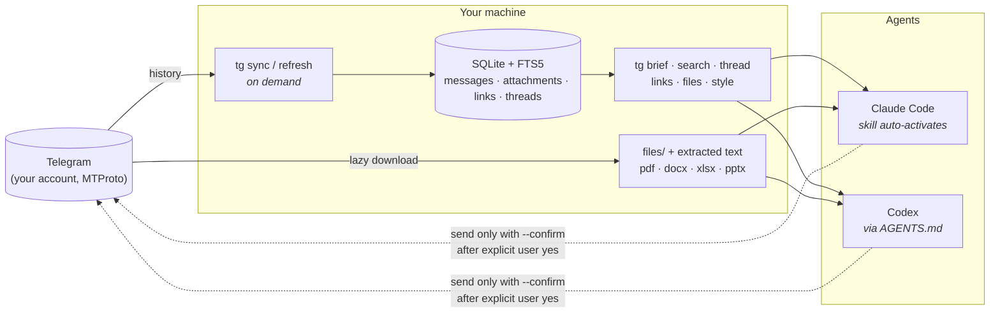

<div align="center">


**English** · [Русский](README.ru.md)

[](https://github.com/voftik/telegram-to-agent-skill-cli/actions/workflows/ci.yml)
[](https://pypi.org/project/telegram-to-agent-skill-cli/)
[](https://www.npmjs.com/package/telegram-to-agent-skill-cli)
[](LICENSE)


*Ask your coding agent "what did the team discuss this week?" and it actually knows.*

</div>

---

Half of every project's real context lives in Telegram: decisions made in group chats, specs shared as files, links that never made it to the wiki. This tool gives that context to Claude Code, Codex, or any agent that can run a CLI.

The `tg` CLI signs in as you (MTProto via [Telethon](https://github.com/LonamiWebs/Telethon)), syncs your chats into a local SQLite index with full-text search, and installs an agent skill that activates itself whenever you mention your chats. Agents read locally: instant, offline, no rate limits. The CLI touches Telegram only to sync, download files, or (after your explicit "yes") send a reply.

<div align="center">

</div>

## Install

Pick any of the three. Each one ends in the interactive setup wizard, which collects API credentials, signs you in, installs the agent skill and offers the initial sync.

```bash
# with uv (recommended)
uv tool install telegram-to-agent-skill-cli && tg setup
```

```bash
# one-shot, no prior install
uvx --from telegram-to-agent-skill-cli tg setup
```

```bash
# via npm, if Node is your home turf
npx telegram-to-agent-skill-cli
```

Developers clone the repo and run `./install.sh` (editable install, same wizard). Details: [docs/INSTALL.md](docs/INSTALL.md).

Claude Code users can also add the repo as a plugin marketplace, which installs the skill without touching the shell:

```
/plugin marketplace add voftik/telegram-to-agent-skill-cli
/plugin install telegram-context@telegram-to-agent-skill-cli
```

The CLI itself still comes from PyPI (the skill will tell you the install command if `tg` is missing).

## Update

```bash
tg update          # checks PyPI, upgrades, refreshes the agent skill
tg update --check  # just report; agents read update.update_available from `tg status --yaml`
```

The CLI never phones home on its own in data commands: the passive version hint reads a local cache and prints to stderr only in interactive sessions. Set `TG_UPDATE_CHECK=0` to silence it.

## Why skill + CLI, not an MCP server

- **Zero context tax.** MCP tool schemas eat thousands of tokens in every session. A skill loads on demand; the CLI costs nothing until used.
- **One integration, every agent.** The same `tg` commands work in Claude Code, Codex, and anything else with a shell.
- **No session juggling.** MCP servers spawn per agent session and fight over the Telethon session file. Here one sync process writes and any number of agent sessions read.

## How it works



## What agents can do with it

| Ask in plain language | What happens under the hood |
| --- | --- |
| "What did we discuss in the project chat?" | `sync`, then `brief` picks the depth, then `recent` and a summary with dates and authors |
| "Find where they shared the pricing doc" | `tg links --kind gdoc` returns the export URL (plain text, not a JS shell) |
| "Read the spec they sent as a file" | `tg files --download` extracts text next to the file |
| "Reconstruct that argument about the deadline" | `tg thread` rebuilds the reply chain, even when the root is a poll |
| "Draft a reply in my voice" | `tg style` gives the agent your own messages; drafts stay dry-run until you say yes |
| "Digest my work chats since yesterday" | the agent loops chats, collects highlights, flags what needs your reaction |

## Safety model

- The Telethon session file equals full account access. It lives in a private data dir (0700/0600), never in git, never in cloud-synced folders; every machine signs in separately.
- Every write to Telegram (`send`, `edit`, `delete`) is a dry-run without `--confirm`. Confirmed mutations land in a durable journal before the network call.
- Untrusted attachments face budgets: size checks before download, zip-bomb guards, streaming hashes, private file modes.
- Use your own `api_id` and `api_hash`. The tool syncs politely (delays, jitter, FloodWait handling) and reads locally.

## How it compares

Honest comparison with the other ways to give an agent your Telegram (state of the ecosystem, August 2026):

| | **tg (this project)** | Telegram MCP servers¹ | Upstream tg-cli | Telegram Desktop export |
| --- | --- | --- | --- | --- |
| Works in any CLI agent | yes, one install | per-agent MCP config | yes | manual copy-paste |
| Session context cost | zero until used | tool schemas eat tokens in every session | zero | zero |
| Search over all history | FTS5, milliseconds, offline | live API calls, rate-limited | `LIKE` scan | none (static files) |
| Attachments as readable text | pdf/docx/xlsx/pptx extracted | download at best | not stored | raw files |
| Google Docs links | ready-to-fetch export URLs | no | no | no |
| Thread reconstruction | yes, incl. t.me links | partial | no | no |
| Parallel agent sessions | any number of readers | session-file conflicts² | single user | n/a |
| Send safety | dry-run default, `--confirm`, journal | varies; several send immediately | sends immediately | n/a |
| Sync integrity | gap-safe cursors, `tg backfill` | n/a (live reads) | best effort | one-off snapshot |
| Data freshness | incremental sync in seconds | always live | incremental | frozen at export |
| Install and update | `npx`/`uv` one-liner, `tg update` | manual server config | pip | built into the app |

¹ chigwell/telegram-mcp, chaindead/telegram-mcp, overpod/mcp-telegram and similar. They fit well when your agent lives in claude.ai web where a CLI is unavailable, and chaindead's drafts-only design is a genuinely safe touch.
² Telethon/GramJS allow one process per session file; MCP servers spawn per agent session and collide (the shared-daemon setups that avoid this need extra configuration).

## What the fork adds over upstream tg-cli

| Area | [upstream](https://github.com/jackwener/tg-cli) | this fork |
| --- | --- | --- |
| Attachments | not stored | indexed at sync, lazy download, text extraction (pdf/docx/xlsx/pptx/csv) |
| Links | not extracted | `tg links` with agent-fetchable `fetch_url`, structural URL parsing |
| Threads | none | `tg thread`, resilient to unsynced roots, t.me link support |
| Search | `LIKE` scan | FTS5 with Unicode-correct fallback and gap-safe regex paging |
| Sync integrity | best effort | gap-safe cursors, `tg backfill`, honest per-chat reports |
| Identity | bare IDs collide | marked peer IDs end-to-end with lazy migration |
| First sync | manual | `tg bootstrap`: survives reboots, removes itself when done |
| Send safety | sends immediately | dry-run by default, `--confirm`, mutation journal |
| Agent integration | a doc file | packaged skill, setup wizard, self-update, auto-activation |

## Credits

A fork of [jackwener/tg-cli](https://github.com/jackwener/tg-cli) (Apache-2.0): the clean local-first core is theirs. Built on [Telethon](https://github.com/LonamiWebs/Telethon). License: [Apache-2.0](LICENSE).
