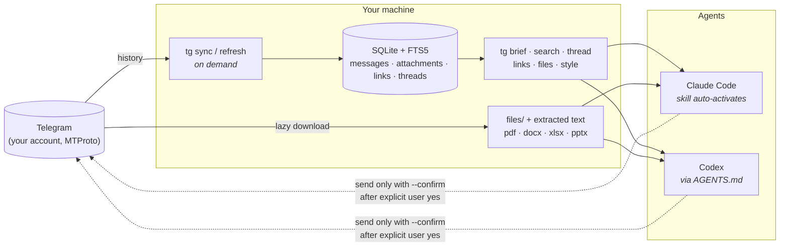

<div align="center">


**English** · [Русский](README.ru.md)

[](https://github.com/voftik/telegram-to-agent-skill-cli/actions/workflows/ci.yml)
[](LICENSE)


[](CONTRIBUTING.md)

*Ask your coding agent "what did the team discuss this week?" — and it actually knows.*

</div>

---

Half of every project's real context lives in Telegram: decisions made in group chats, specs shared as files, links to docs that never made it to the wiki. `telegram-to-agent-skill-cli` gives that context to Claude Code, Codex, or any agent that can run a CLI.

It logs in as **you** (MTProto via [Telethon](https://github.com/LonamiWebs/Telethon)), syncs chats into a **local SQLite index** with full-text search, and ships an **agent skill that activates itself** whenever you mention your chats. Agents read locally — instant, offline, no rate limits — and touch Telegram only to sync, download files, or (after your explicit "yes") send a reply.

<div align="center">

</div>

## Why skill + CLI, not an MCP server?

- **Zero context tax.** MCP tool schemas eat thousands of tokens in *every* session. A skill loads on demand; the CLI costs nothing until used.
- **One integration, every agent.** The same `tg` commands work in Claude Code, Codex, and anything else with a shell.
- **No session juggling.** MCP servers spawn per agent session and fight over the Telethon session file. Here one sync process writes and any number of agent sessions read.

## How it works



## What agents can do with it

| Ask in plain language | What happens under the hood |
| --- | --- |
| *"What did we discuss in the project chat?"* | `sync` → `brief` (pick depth) → `recent` → summary with dates and authors |
| *"Find where they shared the pricing doc"* | `tg links --kind gdoc` → fetches the **export URL** (plain text, not a JS shell) |
| *"Read the spec they sent as a file"* | `tg files --download` → text extracted next to the file |
| *"Reconstruct that argument about the deadline"* | `tg thread` — full reply chain, even when the root is a poll |
| *"Что мне ответить? Напиши как я"* | `tg style` corpus → drafts in your voice → **dry-run preview** → sends only after your "yes" |
| *"Digest my work chats since yesterday"* | loops chats, collects highlights, flags what needs your reaction |

## Quick start

```bash
git clone https://github.com/voftik/telegram-to-agent-skill-cli.git
cd telegram-to-agent-skill-cli && ./install.sh
```

Then three manual steps: put your `api_id`/`api_hash` from [my.telegram.org](https://my.telegram.org) into the generated `.env`, run `tg whoami` (code arrives in your Telegram app), and kick off the initial sync with `tg refresh`. Details, background-sync recipe and security notes: **[docs/INSTALL.md](docs/INSTALL.md)**.

The installer is idempotent: CLI via `uv`, skill symlinked into `~/.claude/skills/`, marker-guarded auto-activation snippets appended to `~/.claude/CLAUDE.md` and `~/.codex/AGENTS.md`.

## What the fork adds over upstream tg-cli

| Area | [upstream](https://github.com/jackwener/tg-cli) | this fork |
| --- | --- | --- |
| Attachments | not stored | indexed at sync, lazy `--download`, text extraction (pdf/docx/xlsx/pptx/csv) |
| Media-only messages | silently dropped | kept — a file without caption is still a message |
| Links | — | `tg links` with agent-fetchable `fetch_url`; Google Docs/Sheets/Slides → export endpoints |
| Threads | — | `tg thread`, resilient to unsynced roots |
| Search | `LIKE` scan | FTS5 (prefixes, phrases) + substring fallback |
| Your voice | — | `tg style` — corpus of your own messages |
| Send safety | sends immediately | **dry-run by default**, `--confirm` + `sent.log` audit |
| Agent integration | SKILL.md doc | installable skill, scenario playbooks, auto-activation for two agent ecosystems |
| Voice messages | — | downloaded; `transcript_path` schema hook for v2 |

## Security model

- The Telethon **session file = full account access**. It lives in a `700` data dir, never in git, never in cloud-synced folders; each machine authorizes separately.
- **Sending is physically gated**: without `--confirm` the command is a dry-run; agents are instructed to show the text and wait for your explicit "yes". Every send lands in `sent.log`.
- Use your own `api_id`/`api_hash`. Telegram throttles aggressive user-API automation — this tool syncs politely (`--delay`, jitter, FloodWait handling) and reads locally.

## Roadmap

- **v2:** voice & video-note transcription (schema hook already in place), Russian morphology for search (pymorphy3), optional chat denylist.
- Open to PRs — see [CONTRIBUTING.md](CONTRIBUTING.md).

## Credits

A fork of [jackwener/tg-cli](https://github.com/jackwener/tg-cli) (Apache-2.0) — the clean local-first core is theirs. Built on [Telethon](https://github.com/LonamiWebs/Telethon). License: [Apache-2.0](LICENSE).
