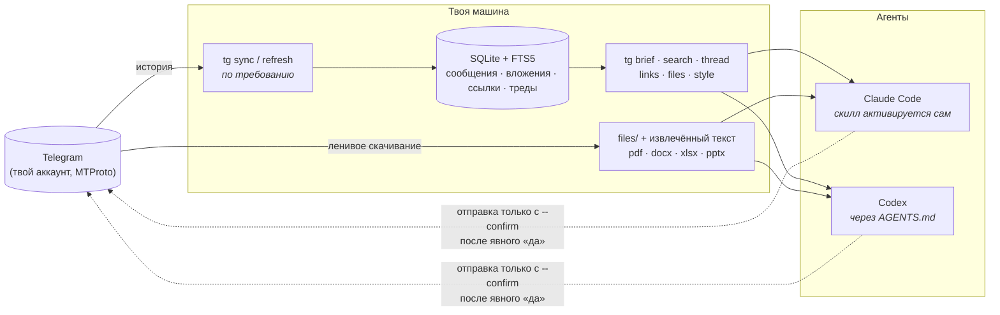

<div align="center">


[English](README.md) · **Русский**

[](https://github.com/voftik/telegram-to-agent-skill-cli/actions/workflows/ci.yml)
[](LICENSE)


[](CONTRIBUTING.md)

*Спроси агента «что обсуждали в рабочем чате на этой неделе?» — и он действительно знает.*

</div>

---

Половина реального контекста любого проекта живёт в Telegram: решения из групповых чатов, ТЗ файлами, ссылки на доки, которые так и не доехали до вики. `telegram-to-agent-skill-cli` отдаёт этот контекст Claude Code, Codex и любому агенту, умеющему запускать CLI.

Инструмент логинится **твоим** аккаунтом (MTProto через [Telethon](https://github.com/LonamiWebs/Telethon)), синкает чаты в **локальный SQLite-индекс** с полнотекстовым поиском и ставит **скилл, который активируется сам**, когда ты упоминаешь свои чаты. Агенты читают локально — мгновенно, офлайн, без rate-limit'ов — а к Telegram ходят только за синком, файлами и (после твоего явного «да») отправкой ответа.

<div align="center">

</div>

## Почему skill + CLI, а не MCP-сервер?

- **Ноль налога на контекст.** Схемы MCP-инструментов съедают тысячи токенов в *каждой* сессии. Скилл подгружается по требованию; CLI не стоит ничего, пока не вызван.
- **Одна интеграция — все агенты.** Те же команды `tg` работают в Claude Code, Codex и где угодно, где есть shell.
- **Нет войны за сессию.** MCP-серверы плодятся по одному на сессию агента и дерутся за session-файл Telethon. Здесь пишет один процесс синка, а читает сколько угодно агентских сессий.

## Как это устроено



## Что агенты умеют с этим делать

| Просьба обычным языком | Что происходит под капотом |
| --- | --- |
| «Что обсуждали в чате проекта?» | `sync` → `brief` (выбор глубины) → `recent` → саммари с датами и авторами |
| «Найди, где кидали док с ценами» | `tg links --kind gdoc` → фетч **export-URL** (чистый текст, а не JS-обёртка) |
| «Прочитай спеку, которую скинули файлом» | `tg files --download` → текст извлечён рядом с файлом |
| «Восстанови тот спор про дедлайн» | `tg thread` — вся цепочка ответов, даже если корень — опрос |
| «Что мне ответить? Напиши как я» | корпус `tg style` → черновики твоим голосом → **dry-run превью** → отправка только после «да» |
| «Дайджест рабочих чатов со вчера» | обход чатов, сбор главного, флаги «требует реакции» |

## Быстрый старт

```bash
git clone https://github.com/voftik/telegram-to-agent-skill-cli.git
cd telegram-to-agent-skill-cli && ./install.sh
```

Дальше три ручных шага: вписать `api_id`/`api_hash` с [my.telegram.org](https://my.telegram.org) в созданный `.env`, выполнить `tg whoami` (код придёт в приложение Telegram) и запустить первичный синк `tg refresh`. Подробности, рецепт фонового синка и заметки о безопасности: **[docs/INSTALL.md](docs/INSTALL.md)**.

Установщик идемпотентен: CLI через `uv`, скилл симлинком в `~/.claude/skills/`, сниппеты авто-активации с маркером — в `~/.claude/CLAUDE.md` и `~/.codex/AGENTS.md`.

## Что форк добавляет к upstream tg-cli

| Область | [upstream](https://github.com/jackwener/tg-cli) | этот форк |
| --- | --- | --- |
| Вложения | не хранятся | индексация при синке, ленивый `--download`, извлечение текста (pdf/docx/xlsx/pptx/csv) |
| Сообщения-файлы без текста | молча пропускаются | сохраняются — файл без подписи тоже сообщение |
| Ссылки | — | `tg links` с готовым `fetch_url`; Google Docs/Sheets/Slides → export-эндпоинты |
| Треды | — | `tg thread`, устойчив к несинканным корням |
| Поиск | `LIKE`-скан | FTS5 (префиксы, фразы) + фолбэк на подстроки |
| Твой голос | — | `tg style` — корпус собственных сообщений |
| Безопасность отправки | шлёт сразу | **dry-run по умолчанию**, `--confirm` + журнал `sent.log` |
| Интеграция с агентами | SKILL.md как документ | устанавливаемый скилл, плейбуки сценариев, авто-активация в двух экосистемах |
| Голосовые | — | скачиваются; крючок `transcript_path` в схеме под v2 |

## Модель безопасности

- **Session-файл Telethon = полный доступ к аккаунту.** Живёт в каталоге с правами `700`, никогда не попадает в git и облачные папки; каждая машина авторизуется отдельно.
- **Отправка закрыта физически**: без `--confirm` команда — dry-run; агентам предписано показать текст и дождаться явного «да». Каждая отправка фиксируется в `sent.log`.
- Используй собственные `api_id`/`api_hash`. Telegram троттлит агрессивную автоматизацию user-API — инструмент синкает вежливо (`--delay`, джиттер, обработка FloodWait) и читает локально.

## Планы

- **v2:** транскрипция голосовых и видеокружков (крючок в схеме уже есть), русская морфология в поиске (pymorphy3), опциональный denylist чатов.
- PR приветствуются — см. [CONTRIBUTING.md](CONTRIBUTING.md).

## Благодарности

Форк [jackwener/tg-cli](https://github.com/jackwener/tg-cli) (Apache-2.0) — чистое local-first ядро принадлежит им. Работает на [Telethon](https://github.com/LonamiWebs/Telethon). Лицензия: [Apache-2.0](LICENSE).
