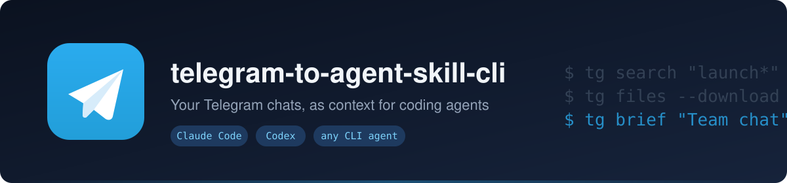
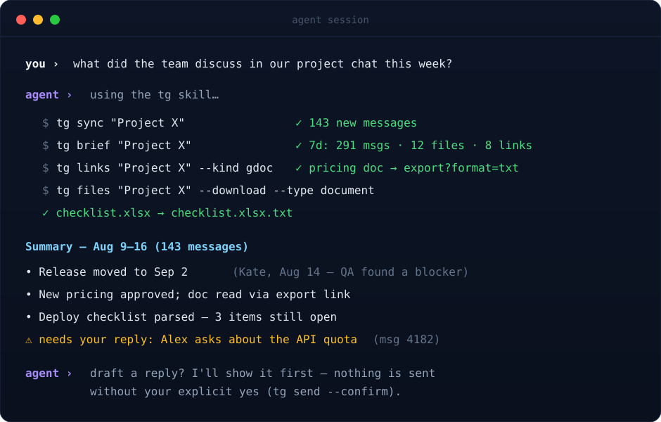
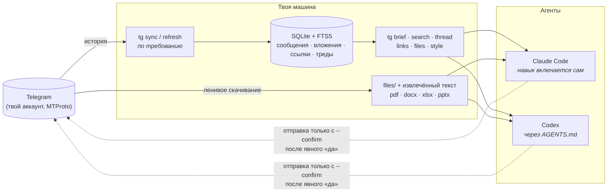

<div align="center">



[English](README.md) · **Русский**

[](https://github.com/voftik/telegram-to-agent-skill-cli/actions/workflows/ci.yml)
[](https://pypi.org/project/telegram-to-agent-skill-cli/)
[](https://www.npmjs.com/package/telegram-to-agent-skill-cli)
[](LICENSE)


*Спроси агента «что обсуждали в рабочем чате на этой неделе?», и он ответит по делу.*

</div>

---

Половина рабочего контекста живёт в Telegram: команда принимает решения в чатах, коллеги кидают ТЗ файлами и ссылки на доки, которые никто не перенёс в вики. Этот инструмент отдаёт весь этот контекст Claude Code, Codex и любому агенту, который умеет запускать команды.

CLI `tg` входит в Telegram твоим аккаунтом (MTProto через [Telethon](https://github.com/LonamiWebs/Telethon)), складывает чаты в локальную базу SQLite с полнотекстовым поиском и ставит навык, который агент включает сам, как только ты упоминаешь свои чаты. Агент читает локальную базу: мгновенно, офлайн, без лимитов Telegram. К самому Telegram инструмент ходит только за синхронизацией, файлами и отправкой ответа, причём отправит только после твоего явного «да».

<div align="center">

</div>

## Установка

Выбери любой из трёх путей. Каждый заканчивается интерактивным визардом: он спросит API-ключи, проведёт вход, поставит навык агентам и предложит первую синхронизацию.

```bash
# через uv (рекомендую)
uv tool install telegram-to-agent-skill-cli && tg setup
```

```bash
# разовый запуск без установки
uvx --from telegram-to-agent-skill-cli tg setup
```

```bash
# через npm, если тебе привычнее Node
npx telegram-to-agent-skill-cli
```

Разработчики клонируют репозиторий и запускают `./install.sh`: тот ставит editable-версию и открывает тот же визард. Подробности: [docs/INSTALL.md](docs/INSTALL.md).

## Обновление

```bash
tg update          # проверит PyPI, обновит CLI и навык
tg update --check  # только проверка; агенты смотрят update.update_available в tg status --yaml
```

Команды с данными в сеть за версиями не ходят: подсказка о новой версии читает локальный кэш и печатается в stderr только в живом терминале. Переменная `TG_UPDATE_CHECK=0` отключает её совсем.

## Почему навык + CLI, а не MCP-сервер

- **Контекст остаётся агенту.** Схемы MCP-инструментов съедают тысячи токенов в каждой сессии. Навык подгружается по требованию, а CLI не стоит ничего, пока его не позвали.
- **Одна интеграция на всех.** Те же команды `tg` работают в Claude Code, Codex и везде, где есть терминал.
- **Никакой борьбы за сессию.** MCP-серверы плодятся по одному на сессию агента и дерутся за session-файл Telethon. Здесь пишет один процесс синхронизации, а читают сколько угодно агентов.

## Как это устроено



## Что агент умеет с этим делать

| Просьба обычным языком | Что агент делает под капотом |
| --- | --- |
| «Что обсуждали в чате проекта?» | синхронизирует чат, оценивает объём через `brief`, читает `recent` и пишет саммари с датами и авторами |
| «Найди, где кидали док с ценами» | `tg links --kind gdoc` отдаёт export-ссылку: чистый текст вместо JS-обёртки |
| «Прочитай спеку, которую скинули файлом» | `tg files --download` кладёт рядом с файлом извлечённый текст |
| «Восстанови тот спор про дедлайн» | `tg thread` собирает цепочку ответов, даже если корень треда это опрос |
| «Напиши ответ моим голосом» | `tg style` даёт агенту корпус твоих сообщений; черновик остаётся черновиком, пока ты не скажешь «да» |
| «Дайджест рабочих чатов со вчера» | агент обходит чаты, собирает главное и помечает, что ждёт твоей реакции |

## Безопасность

- Session-файл Telethon равен полному доступу к аккаунту. Он лежит в закрытом каталоге (права 0700/0600), не попадает в git и облачные папки; каждая машина входит в аккаунт отдельно.
- Любая запись в Telegram (`send`, `edit`, `delete`) без флага `--confirm` остаётся сухим прогоном. Подтверждённые действия CLI сначала записывает в журнал, потом выполняет.
- Чужие вложения проходят проверки: лимит размера до скачивания, защита от zip-бомб, потоковое хэширование, закрытые права на файлы.
- Заведи собственные `api_id` и `api_hash`. Инструмент синхронизирует вежливо: задержки, джиттер, обработка FloodWait.

## Что форк добавил к исходному tg-cli

| Область | [upstream](https://github.com/jackwener/tg-cli) | этот форк |
| --- | --- | --- |
| Вложения | не хранит | индексирует при синке, качает лениво, извлекает текст (pdf/docx/xlsx/pptx/csv) |
| Ссылки | не извлекает | `tg links` с готовой ссылкой для агента, структурный разбор URL |
| Треды | нет | `tg thread` собирает цепочки, понимает ссылки t.me |
| Поиск | скан через `LIKE` | FTS5 плюс юникодный фолбэк и полный обход в regex-поиске |
| Целостность синка | как получится | курсоры дыр, `tg backfill`, честный отчёт по каждому чату |
| Идентификаторы | голые ID сталкиваются | marked ID везде, ленивая миграция старых баз |
| Первый синк | вручную | `tg bootstrap` переживает перезагрузки и убирает себя сам |
| Отправка | шлёт сразу | сухой прогон по умолчанию, `--confirm`, журнал операций |
| Интеграция с агентами | файл с документацией | навык в пакете, визард установки, самообновление, автовключение |

## Благодарности

Форк [jackwener/tg-cli](https://github.com/jackwener/tg-cli) (Apache-2.0): чистое local-first ядро придумали они. Работает на [Telethon](https://github.com/LonamiWebs/Telethon). Лицензия: [Apache-2.0](LICENSE).
